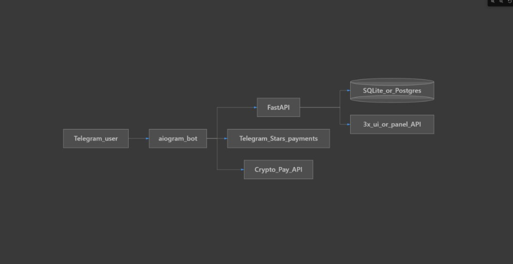
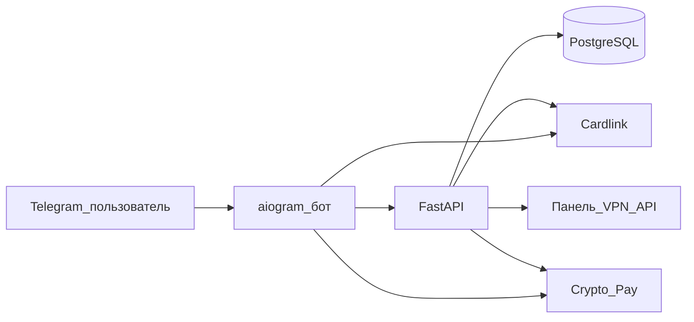
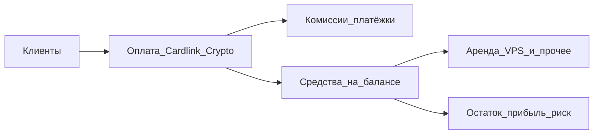

# VPN-подписка: Telegram-бот + API

Telegram-бот на **aiogram 3** и бэкенд на **FastAPI**: оплата картой через **Cardlink** и криптой через **Crypto Pay** (@CryptoBot), учёт подписок в **PostgreSQL**.

---

## Содержание

1. [Как это устроено (схема)](#как-это-устроено-схема)
2. [Тарифы в проекте](#тарифы-в-проекте)
3. [Цена для клиента и окупаемость](#цена-для-клиента-и-окупаемость)
4. [Технические требования](#технические-требования)
5. [Интеграция Cardlink](#интеграция-cardlink)
6. [Быстрый старт (Docker)](#быстрый-старт-docker)
7. [HTTPS](#https)
8. [Локальный запуск](#локальный-запуск-без-docker)
9. [Структура репозитория](#структура-репозитория)
10. [Переменные окружения](#переменные-окружения)

---

## Как это устроено (схема)

Поток данных: пользователь в Telegram взаимодействует с ботом; бот создаёт платежи (Cardlink / Crypto); вебхуки приходят на **FastAPI**; подписки и платежи пишутся в БД; при необходимости backend обращается к API панели VPN (3x-ui и аналоги).



Ниже — актуальная для этого репозитория схема (в коде нет оплаты Stars, есть Cardlink + Crypto Pay):



---

## Тарифы в проекте

Цифры задаются в [`app/tariffs.py`](app/tariffs.py) (их можно менять под рынок):

| Тариф | Период | Cardlink (₽) | Crypto (пример) |
|-------|--------|--------------|-----------------|
| `month` | 30 дней | 499 ₽ | 5 USDT |
| `quarter` | 90 дней | 1 290 ₽ | 12 USDT |

Эквивалент «в месяц» для квартала: \(1290 / 3 \approx 430\) ₽/мес при оплате кварталом — удобно использовать в расчётах среднего чека.

---

## Цена для клиента и окупаемость

Ниже — **иллюстрация**, не финансовая консультация. Подставьте свои расходы на VPS, домен, комиссии эквайринга и курс валют.

### 1. Какие бывают расходы

| Статья | Комментарий |
|--------|-------------|
| **VPS под бота + API + БД** | Отдельная машина или тот же хост, что и VPN — влияет на риск перегруза |
| **VPS под VPN-узел(ы)** | Чем больше одновременных клиентов, тем выше класс тарифа или число серверов |
| **Домен, бэкапы, мониторинг** | Часто +300–1500 ₽/мес в сумме |
| **Комиссия Cardlink** | Зависит от тарифа мерчанта; в расчётах часто закладывают **3–7%** от оборота по картам |
| **Crypto Pay** | Свои правила и курс USDT — учитывайте отдельно |

### 2. Формула «не уйти в минус» по постоянным расходам

Обозначения:

- \(F\) — **фиксированные расходы в месяц** (аренда всех VPS + домен + прочее), ₽  
- \(N\) — число **активно платящих** клиентов в среднем за месяц  
- \(P\) — **средняя выручка с одного клиента в месяц**, ₽ (с учётом того, что кто-то платит кварталом — см. эквивалент выше)  
- \(k\) — доля **комиссий и потерь** на платежах (0–1), например 0,05 = 5%

Грубо (без учёта трафика сверх лимита):

\[
\text{Чистый поток} \approx N \cdot P \cdot (1 - k) - F
\]

**Точка безубыточности** по постоянным затратам (приближённо):

\[
N_{\min} \approx \frac{F}{P \cdot (1 - k)}
\]

### 3. Числовой пример (замените на свои цифры)

Допустим:

- \(F = 5\,500\) ₽/мес (два недорогих VPS + мелочи)  
- средний эквивалент \(P = 450\) ₽/мес с клиента (смесь месячных и квартальных оплат)  
- \(k = 0{,}05\) (5% на комиссии)

Тогда:

- выручка «на руки» с одного клиента: \(450 \times 0{,}95 \approx 427{,}5\) ₽  
- \(N_{\min} \approx 5500 / 427{,}5 \approx 13\) платящих клиентов, чтобы покрыть **только** эти постоянные расходы  

Если хотите **запас** (например, +20% к \(F\) под рекламу и сбои), замените \(F\) на \(1{,}2 \cdot F\) в формуле.

### 4. Сколько «снимать с человека в месяц»

Ориентиры:

- Смотрите **конкурентов** в нише и **готовность платить** аудитории.  
- Текущие значения в коде (**499 ₽ / мес** и **1290 ₽ / 90 дней**) — разумная стартовая вилка для РФ при условии, что инфраструктура не раздута.  
- Если \(N_{\min}\) получается неподъёмно большим — **поднимите \(P\)** или **снизите \(F\)** (объединить сервисы на одном VPS на старте, потом масштабировать).

### 5. Поток денег (упрощённо)



Итог: **сначала** посчитайте \(F\) и желаемую прибыль, **потом** проверьте формулой, хватает ли \(N\) и \(P\), чтобы не работать в убыток.

---

## Технические требования

- Python 3.11+
- Docker / Docker Compose (рекомендуется)
- Токен бота [@BotFather](https://t.me/BotFather)
- Аккаунт [cardlink.link](https://cardlink.link): магазин после модерации, **API token** и **shop_id**
- Токен **Crypto Pay** из [@CryptoBot](https://t.me/CryptoBot) → Crypto Pay → Create App

---

## Интеграция Cardlink

1. В настройках магазина укажите **Result URL** (postback оплаты):

   `{WEBHOOK_BASE_URL}{CARDLINK_WEBHOOK_PATH}`  
   Пример: `https://vpn.example.com/webhooks/cardlink`

2. Создание счёта в коде: `application/x-www-form-urlencoded`, заголовок `Authorization: Bearer {token}`.

3. Postback: поля `Status`, `InvId`, `OutSum`, `TrsId`, `CurrencyIn`, `custom`, `SignatureValue`. Подпись:

   `SignatureValue = strtoupper(md5(OutSum + ":" + InvId + ":" + apiToken))`

4. Пользователя направляйте на **`link_page_url`** (или `link_url`).

5. В `custom` передаётся `{telegram_id}|{plan_id}` — то же приходит в postback.

---

## Быстрый старт (Docker)

1. Скопируйте [`.env.example`](.env.example) в `.env`, задайте `BOT_TOKEN`, `CARDLINK_TOKEN`, `CARDLINK_SHOP_ID`, при необходимости `CRYPTO_PAY_TOKEN`.

2. Поднимите базу:

```powershell
docker compose up -d db
```

3. Миграции:

```powershell
docker compose run --rm api alembic upgrade head
```

4. Запуск:

```powershell
docker compose up -d api bot
```

5. Проверка: `http://localhost:8000/health`.

В **PowerShell** цепочки команд пишите через `;`, не через `&&`.

Полезные скрипты (из корня репозитория, с активированным venv при необходимости):

- `python scripts/e2e_smoke.py` — проверка маршрута `/health` без запущенного uvicorn
- `python scripts/smoke_check.py` — запрос к уже поднятому API (по умолчанию `http://127.0.0.1:8000/health`)
- `python scripts/print_webhook_urls.py` — напечатать точные URL вебхуков после заполнения `.env`

---

## HTTPS

И Crypto Pay, и Cardlink обращаются к вашему API по **HTTPS**. Для локальной отладки — туннель (ngrok, cloudflared).

- В `.env` укажите `WEBHOOK_BASE_URL=https://ваш-домен` **без** завершающего `/` (тот же домен, на который смотрит reverse proxy).
- Crypto Pay: `{WEBHOOK_BASE_URL}{CRYPTO_WEBHOOK_PATH}`
- `CRYPTO_PAY_USE_TESTNET=true` — тестовая сеть Crypto Pay

Примеры reverse proxy (TLS — Let’s Encrypt или свои сертификаты):

- [deploy/Caddyfile.example](deploy/Caddyfile.example) — прокси на `127.0.0.1:8000`
- [deploy/nginx-api.conf.example](deploy/nginx-api.conf.example) — фрагмент `server {}` для nginx

После смены `.env` перезапустите контейнеры `api` и `bot` (`docker compose up -d api bot`).

---

## Продакшен: краткий чеклист

1. VPS с Docker; `docker compose up -d db`, миграции, `api` + `bot`.
2. Домен и HTTPS перед API (см. примеры в `deploy/`); `WEBHOOK_BASE_URL` на этот URL.
3. Зарегистрировать вебхуки: `python scripts/print_webhook_urls.py`.
4. Задать `SUBSCRIPTION_STUB_TEMPLATE` — URL подписки из 3x-ui или шаблон с `{telegram_id}` / `{plan_id}` / `{user_id}` (см. [.env.example](.env.example)). Иначе в логах будет предупреждение и заглушка.
5. Отдельный VPS под VPN: [server-node/README.md](server-node/README.md) — после установки панели скопируйте subscription URL в шаблон или правьте `subscriptions.config_stub` вручную (пример SQL: [scripts/sql/fix_config_stub_by_telegram.sql.example](scripts/sql/fix_config_stub_by_telegram.sql.example)).
6. В [@BotFather](https://t.me/BotFather) задать **username** бота (нужен для реферальной ссылки); в `.env` при желании `SUPPORT_USERNAME`, `SUPPORT_INFO_URL`.
7. Резервные копии PostgreSQL (том `pgdata` или `pg_dump`).

---

## Локальный запуск без Docker

```powershell
pip install -r requirements.txt
alembic upgrade head
uvicorn app.main:app --reload --host 0.0.0.0 --port 8000
python -m bot.main
```

---

## Веб-админка (Next.js)

Дашборд: подписки, платежи, список скоро истекающих подписок, мониторинг узлов через **Prometheus** (node_exporter).

**1.** В корневом `.env` задайте `ADMIN_API_KEY` (и при необходимости `PROMETHEUS_BASE_URL`, `MONITOR_NODES_JSON` — см. [.env.example](.env.example)).

**2.** Запустите API: `uvicorn app.main:app --host 0.0.0.0 --port 8000`.

**3.** В каталоге `admin-web/`:

```powershell
cd admin-web
copy .env.local.example .env.local
npm install
npm run dev
```

Если в dev-режиме появляется ошибка вроде `Cannot find module './276.js'`, остановите сервер (Ctrl+C) и запустите **`npm run dev:clean`** в `admin-web/` — скрипт удалит кэш `.next` и снова поднимет dev (или выполните `npm run clean`, затем `npm run dev`).

Откройте http://localhost:3000 , войдите паролем из `ADMIN_DASHBOARD_PASSWORD`.

Эндпоинты бэкенда (только с заголовком `X-Admin-Key`): `/admin/api/summary`, `/admin/api/servers`, `/admin/api/payments`, `/admin/api/subscriptions/expiring`.

Проверка API с хоста: `python scripts/e2e_admin_api.py --key ВАШ_КЛЮЧ` (uvicorn должен быть запущен).

### Раздел «Серверы» (Prometheus + node_exporter)

Пока в **корневом** `.env` пусто или `MONITOR_NODES_JSON=[]`, страница «Серверы» показывает, что узлов нет — это ожидаемо.

1. На каждом VPS под мониторинг поднимите **node_exporter** (порт по умолчанию **9100**).
2. Настройте **Prometheus** со `scrape_configs` на эти targets. Важно: в запросах к API используется label **`instance`** — его значение должно **точно совпадать** с тем, что видно в Prometheus (часто `IP:9100` или `host:9100`). Проверка: в UI Prometheus → Graph → запрос `up{job=~".+"}` и список меток `instance`.
3. В `.env` (для **uvicorn**, не для `admin-web`) задайте одной строкой:

```env
PROMETHEUS_BASE_URL=http://127.0.0.1:9090
MONITOR_NODES_JSON=[{"id":"node1","name":"VPN-1","instance":"203.0.113.10:9100","panel_health_url":"https://panel.example.com/login"}]
```

Подставьте свой URL Prometheus (без завершающего `/`), реальный `instance` из Prometheus и по желанию URL страницы панели для проверки доступности.

4. Перезапустите `uvicorn`.

Если Prometheus недоступен с машины, где крутится FastAPI, запросы метрик вернут ошибку в карточке узла — проверьте сеть и firewall.

---

## Структура репозитория

| Путь | Назначение |
|------|------------|
| [`app/main.py`](app/main.py) | FastAPI: webhooks Crypto Pay и Cardlink |
| [`app/payments/cardlink.py`](app/payments/cardlink.py) | Создание счёта, проверка подписи postback |
| [`app/payments/crypto_pay.py`](app/payments/crypto_pay.py) | Crypto Pay API |
| [`app/services/subscription.py`](app/services/subscription.py) | Подписки, платежи |
| [`bot/handlers/payment.py`](bot/handlers/payment.py) | Оплата Cardlink / Crypto |
| [`app/tariffs.py`](app/tariffs.py) | Тарифы (₽ и USDT) |
| [`server-node/`](server-node/) | Скрипты на **каждый VPS** с VPN (UFW, установка 3x-ui), см. [`server-node/README.md`](server-node/README.md) |
| [`deploy/`](deploy/) | Примеры Caddy / nginx для HTTPS → порт API |
| [`scripts/`](scripts/) | Smoke-тесты, печать URL вебхуков, примеры SQL |
| [`admin-web/`](admin-web/) | Next.js-админка (аналитика, узлы через Prometheus) |

После оплаты в `config_stub` пишется значение из `SUBSCRIPTION_STUB_TEMPLATE` или заглушка до настройки панели.

---

## Переменные окружения

См. [`.env.example`](.env.example).
